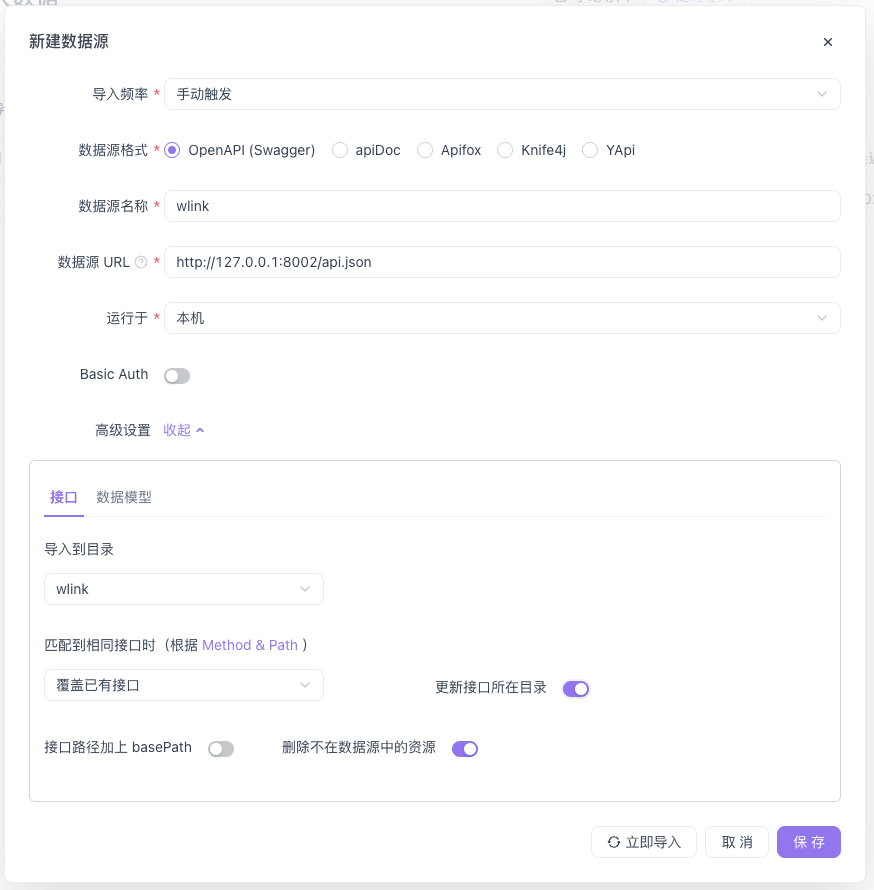

## 概述
 按照gf的规范路由,会自动生成api接口文档,api ui地址为: http://127.0.0.1:8002/swagger/,
 api json地址为 http://127.0.0.1:8002/api.json

 ## Apifox
 建议前后端开发者使用Apifox进行接口测试,流程如下:
 1. 新建项目 wlink,配置环境变量,如图:
 
 2. 导入接口,如图:
 
3. 选择定时导入,配置如图:
 
4. 每次接口变更时,手动导入,如图:
 
