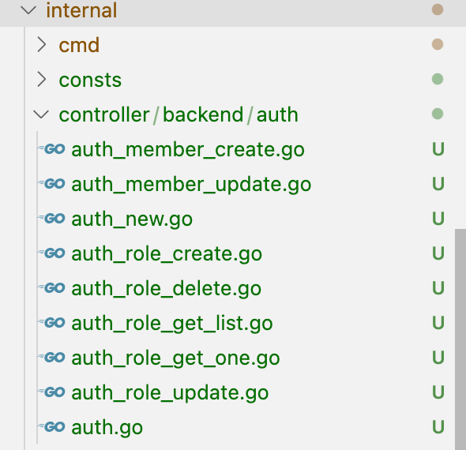

## 概述
- 所有接口必须进行参数验证,不能依赖前端进行验证,如手机号,邮箱,身份证号等,开发人员需要对写入的数据负责
- 如果当前gf组件库和自有库之间无法满足需求,需要增加第三方依赖库,必须经过讨论,必要时,需要增加第三方库的测试
- 优先使用框架自带的参数校验,https://goframe.org/docs/core/gvalid-rules
- apisuper等api接口定义层只可以引用internal/variable,internal/consts,不可以引用其他层
- 内部模块之间的调用参数和返回通过在model层下定义结构体,比如是 controller->service 或者 service->service 之间的调用,这部分输入输出模型名称通常以 XxxInput 和 XxxOutput 格式命名。
- 不会复用的业务逻辑直接写在controller层,需要复用的业务逻辑抽象后写在service层

## 目录结构
```
.
├── .cursor/             # Cursor rules,会为cursor指定该项目的代码规范
├── apibackend/         # 后台 API 定义目录
├── apifrontend/        # 前台 API 定义目录
├── docs/               # 项目文档目录
├── hack/               # 存放项目开发工具、脚本等内容。例如， CLI 工具的配置，各种 shell/bat 脚本等文件。
├── internal/           # 项目核心实现代码
│   ├── cmd/           # 程序入口命令
│   ├── consts/        # 常量定义,所有层均可调用
│   │   └── enum/      # 枚举定义    
│   ├── controller/    # 接口控制器
│   ├── dao/           # dao层的直接子文件,自动生成,可修改,维护一些自定义的表的查询
│   │   └── internal/  # 数据表对应的访问对象,自动生成,不可修改
│   ├── model/         # 与业务相关的通用数据结构定义，其中包含大部分的方法输入输出定义。这里的定义不能被api层引用
│   │   ├── do/        # 用于 dao 数据操作中业务模型与实例模型转换,自动生成,不可修改
│   │   └── entity/    # 数据模型:数据表对应的GO结构,字段类型也一一对应,自动生成,不可修改    
│   ├── packed/        # 打包资源,如枚举类型提取后存放在这里
│   ├── service/       # 复用的业务服务层
│   └── variable/      # 变量定义,所有层均可调用
├── manifest/          # 配置清单目录
│   ├── config/       # 配置文件存放目录。
│   ├── deploy/       # 部署相关文件
│   ├── docker/       # Docker 镜像相关依赖文件，脚本文件等等。
│   ├── i18n/         # 国际化资源文件
│   │   ├── zh-CN/    # 中文资源
│   │   └── en-US/    # 英文资源
│   ├── migration/    # 数据表迁移文件
│   └── protobuf/
├── resource/          # 静态资源目录
├── tmp/               # 临时文件目录
├── utility/           # 工具函数目录,业务无关,不能依赖其他层
├── .air.toml          # Air 热重载配置文件
├── .DS_Store          # macOS 系统文件
├── .gitattributes     # Git 属性配置文件
├── .gitignore         # Git 忽略配置文件
├── .golangci.annotate.yml  # Golang CI 注释配置
├── .golangci.yml      # Golang CI 代码检查配置
├── Makefile           # 项目构建和管理命令
├── README.MD          # 项目说明文档
├── go.mod             # Go 模块依赖定义
├── go.sum             # Go 模块依赖版本锁定
└── main.go            # 主程序入口
```


## CRUD流程
### 定义表
- 在`manifest/migration`目录下创建表结构,执行`make migrate`生成表结构,表规范参见[数据库规范](./数据库规范.md),表定义参考`manifest/migration/20250410120615_create_user_table.sql`
- 然后执行`make dao`或`gf gen dao`生成dao层代码
- 以角色表为例,会生成以下文件
    - `internal/dao/internal/role.go`  
    数据表对应的访问对象,使用如`dao.Role.Ctx(ctx)`,自动生成,**不可修改**
    - `internal/dao/role.go`            
     role自定义的操作逻辑,**可修改**
    - `internal/model/do/role.go`       
     用于 dao 数据操作中业务模型与实例模型转换,根据实际情况选择是否使用,**自动生成,不可修改**
        ```
            id, err := dao.Role.Ctx(ctx).Data(do.Role{
            Name:   req.Name,
            Code:   req.Code,
            Status: req.Status,
            }).InsertAndGetId()
        ```  
    - `internal/model/entity/role.go`   
     数据模型:数据表对应的GO结构,字段类型也一一对应,**自动生成,不可修改**    


### 定义api接口
- 后台api接口定义在apibackend层,前台api接口定义在apifrontend层,层次结构满足`apibackend/模块/子模块/文件名.go`
- 以角色创建为例,这里禁止引用enity下的定义,将相关字段复制过来, 具体参考: `apibackend/auth/role/role.go`
    ```go
    type RoleArg struct {
        Name   string      `json:"name" v:"required|length:3,10|unique-field:role#cg.role.name.required|cg.role.name.length|cg.role.name.unique" example:"管理员" dc:"角色名称" `
        Code   string      `json:"code" v:"required|length:3,10|unique-field:role#cg.role.code.required|cg.role.code.length|cg.role.code.unique" example:"admin" dc:"角色权限字符串" `
        Status enum.Status `json:"status" v:"required|enums#cg.role.status.required|cg.role.status.enums"  example:"normal" dc:"状态,disabled:禁用,normal:正常" `
    }

    type CreateReq struct {
        g.Meta `path:"/role/create" tags:"权限/角色" method:"post" summary:"创建角色"`
        RoleArg
    }

    type CreateRes struct {
        Id int64 `json:"id" dc:"角色ID"`
    }
    ```
- 注意事项
    - api定义的结构体名称需要满足 `操作+Req` 及 `操作+Res` 的命名方式规范,crud常见操作 创建,修改,删除,查询分页列表,查询列表(不需要分页),查询详情,对应的命名分别为 `CreateReq/Res`, `UpdateReq/Res`, `DeleteReq/Res`, `GetPageListReq/Res`,`GetListReq/Res`, `GetOneReq/Res`,对应的path分别为 `/操作/create`, `/操作/update`, `/操作/delete`, `/操作/page_list`, `/操作/list`, `/操作/one`,查询操作使用 `Get`方法,其他统一使用 `Post`方法,方便权限管理
    - 优先使用框架自带的参数校验, https://goframe.org/docs/core/gvalid-rules,  
    如果需要复用校验规则且没有内置规则,在`internal/service/valid`目录下创建对应校验规则文件,所有的提示语采用国际化
    - tag标签严格按照 `json,v,example,dc` 顺序
    - 需要使用枚举类型的在`internal/consts/enum`目录下创建枚举类型,使用`make enum` 生成枚举类型,api结构体中引用后,可直接在api文档中显示枚举类型
### 生成controller
- api结构定义完成后使用`make ctrl-backend` 生成controller,生成的controller文件按照一个操作一个文件的形式,如图:


- 在controller层开始具体的业务逻辑代码,错误处理参见[错误处理](./错误处理.md),开头增加链路追踪,如:
```go
	ctx, span := st.GetTracer().NewSpan(ctx, "Create")
	defer span.End()
```
- 生成的auth.go文件,该文件只会生成一次，可以在里面填充必要的预定义代码内容，例如，该模块 controller 内部使用的变量、常量、数据结构定义
### 注意事项
- 指针结合 do 对象实现当传递该参数时执行修改，不传递时不修改。 https://goframe.org/docs/core/gdb-practice-using-pointer-and-do-for-update-api
    ```go
        type UpdateReq struct {
            g.Meta   `path:"/user/{Id}" method:"post" summary:"修改用户信息"`
            Passport string  `v:"required" dc:"用户账号"`
            Password *string `dc:"修改用户密码"`
            Nickname *string `dc:"修改用户昵称"`
            Status   *Status `dc:"修改用户状态"`
            Brief    *string `dc:"修改用户描述"`
        }
        // do 对象中的 nil 字段将会被自动过滤掉。
        func (c *Controller) Update(ctx context.Context, req *v1.UpdateReq) (res *v1.UpdateRes, err error) {
            _, err = dao.User.Ctx(ctx).Data(do.User{
                Password: req.Password,
                Nickname: req.Nickname,
                Status:   req.Status,
                Brief:    req.Brief,
            }).Where(do.User{
                Passport: req.Passport,
            }).Update()
            return
        }
    ``` 

- 查询时避免返回对象初始化及 sql.ErrNoRows 判断
    ```go
    // bad
        func (s *sTask) GetOne(ctx context.Context, id uint64) (out *entity.ResourceTask, err error) {
            out = new(model.TaskDetail)
            err = dao.ResourceTask.Ctx(ctx).WherePri(id).Scan(out) // out被初始化
            if err != nil {
                if err == sql.ErrNoRows {
                    err = gerror.Newf(`record not found for "%d"`, id)
                }
                return
            }
            return
        }

    // good
    func (s *sTask) GetOne(ctx context.Context, id uint64) (out *entity.ResourceTask, err error) {
        err = dao.ResourceTask.Ctx(ctx).WherePri(id).Scan(&out) // 如果没有数据,out为nil
        if err != nil {
            return
        }
        if out == nil {
            err = gerror.Newf(`record not found for "%d"`, id)
        }
        return
    }


    ```


