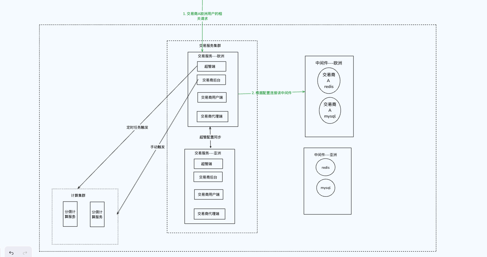

## 概述
- 业务上分为4端: 超管端,交易商端,用户端,代理端
- 服务架构上分为2端: 交易服务,计算服务
- 一个基本的业务流程是,超管端创建一个交易商,填入数据库,redis,账号,域名相关信息,自动生成数据库交易商相关基础表,交易商完成配置后,用户端和代理端可以进行访问

## 整体架构图

## 交易服务
- 核心的逻辑都在交易商端,每个交易商的数据库和redis可独立配置,对应的业务端如下
    -  超管端
    -  交易商端
        -  后台
        -  用户端
        -  代理端
- 可横向部署
- 架构
    - **超管端,交易商端,用户端和代理端为同一个无状态大单体服务**,后续该服务称为**交易服务**,交易服务可以横向扩展,业务上通过访问域名区分,如
        - 超管端域名为: www.wlink.com
        - 交易商A
            - 后台为: tenant-a.wlink.com
            - 代理端: agent-a.wlink.com
            - 用户端: client-a.wlink.com
        - 交易商B
            - 后台为: tenant-b.wlink.com
            - 代理端: agent-b.wlink.com
            - 用户端: client-b.wlink.com

    - 超管端:
        - 超管端访问的是平台mysql,平台mysql里面记录了所有交易商相关信息和平台配置信息
        - 当服务启动时,超管端将所有交易商相关信息和配置写入到本地缓存
        - 当交易商信息和配置发生变更时,通过发布订阅模式通知其他交易服务,其他交易服务删除缓存,重新拉取mysql里面的配置
    - 交易商端:
        - 由中间件根据访问的域名将该交易商使用的redis和mysql的信息注入到golang的context上下文对象中,后续该请求的所有访问都根据上下文对象中redis和mysql信息在本地缓存中拿到具体的连接
    - 负载均衡
        - 考虑维度: 地理位置和流量
        - 交易商用户相对集中
            - 假设交易商A和和其大多数用户都在欧洲地区,则交易服务和交易商A的数据库,redis等也一同部署到欧洲地区,对交易商A的访问会根据地理位置路由到欧洲地区的服务
            - 如果交易商A的用户量快速增长,单个交易服务无法承载,则横向扩展交易服务数量
            - 最终负载均衡根据两个维度进行负载均衡,首先根据地址位置负载均衡到某个区域后,再根据区域内的交易服务数量选择负载均衡算法,比如轮训,ip哈希等

        - 交易商用户分散
            - 需要考虑redis和mysql的分布式部署,可行方案如下
                - 数据库可选方案: TIDB,阿里云PolarDB, 自主实现mysql读写分离 + 区域性读副本(需要考虑写延迟,数据同步延迟)
                - redis可选方案: 如阿里云Tair
## 计算服务
- 可横向部署
- 比如分佣计算任务,分佣计算是针对每个交易商的,触发方式有定时触发和手动触发,计算服务提供分佣计算rpc,超管端通过定时任务触发,比如每天24点触发,交易服务后台也可以手动触发
- 使用分布式锁避免竞态情况
- 负载均衡
    - 负载均衡根据情况使用轮训或基于节点性能

