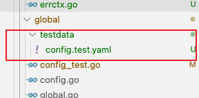

## 概述
- 使用gf测试库github.com/gogf/gf/v2/test/gtest
- **尽量把关键的待测试逻辑抽离出来,封装成函数,不要有过多依赖,提高单元测试难度,** 比如
    - 在单元测试中构建一个request请求相对麻烦,关键的逻辑抽离到`buildErrResponse`,不直接依赖request
    -  bad
        ```go
        func HandlerResponse(r *ghttp.Request) {
            r.Middleware.Next()
            isDebug := global.GetConfig().GetDebug(r.Context())
            // ...其他代码
            buildResponse(r,isDebug)
        }
        ```
    - good
        ```go
        func HandlerResponse(r *ghttp.Request) {
            r.Middleware.Next()
            isDebug := global.GetConfig().GetDebug(r.Context())

            // ...其他代码
           	err := r.GetError()
            // 如果没有错误,返回成功响应
            if err == nil {
                r.Response.WriteJsonExit(DefaultResponse{
                    Code:    gcode.CodeOK.Code(),
                    Message: g.I18n().T(r.Context(), "business.success"),
                    Data:    r.GetHandlerResponse(),
                })
                return
            }
            // 构建响应
            resp := buildErrResponse(r.Context(), err, isDebug)
        }
        ```     
- 参照gf框架源码,测试物料放在同级文件下的testdata目录下,然后`gtest.DataPath()`函数获取
    - 
    - 测试代码如下:
        ```go
        func TestConfig(t *testing.T) {
            gtest.C(t, func(t *gtest.T) {
                //nolint:errcheck
                gins.Config().GetAdapter().(*gcfg.AdapterFile).SetFileName(gtest.DataPath("config.test.yaml"))
                config := global.GetConfig()
                t.Assert(config.GetDebug(ctx), false)
                err := config.SetDebug(ctx, true)
                t.Assert(err, nil)
                t.Assert(config.GetDebug(ctx), true)
            })
        }
        ```
- 单元测试应该充分测试各种边界情况,参考 `internal/service/middleware/middleware_response_test.go`

- todo mock库,其他情况等待完善