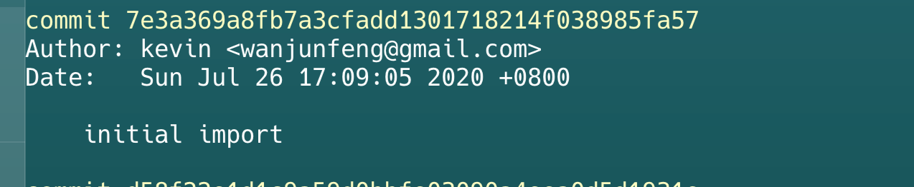
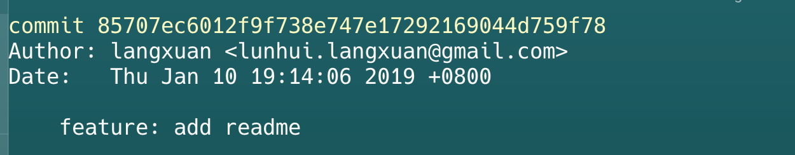

| 特性 | Kratos | GoFrame | Go-Zero |
|------|---------|----------|----------|
| 设计理念 | 可用性、可观测性、工程化 | 模块化、高性能、企业级、开发效率 | 简单、高效、稳定、工具驱动、服务治理 |
| 核心优势 | 强大的可观测性、完善的中间件、大规模生产验证 | 丰富的基础模块、强大的 ORM、开发效率高、文档完善 | 极致的代码生成效率、内置服务治理、高性能 |
| 上手难度 | 相对较高 | 中等，对有其他框架经验者友好 | 相对较低，但需适应工具生成的模式 |
| 代码生成 | kratos tool，生成项目骨架、API 等 | gf-cli，生成代码、热编译、打包等 | goctl，一键生成 API、RPC、Model 等 |
| ORM | 无内置，需自行集成 | 内置强大易用的 gf ORM | 生成基础 Model，复杂操作可能需手写或引入第三方 |
| 微服务治理 | 中间件丰富，需自行组合 | 提供了相关模块，需自行集成 | 内置完善的服务治理能力，开箱即用 |
| 灵活性 | 较高，但有一定规范约束 | 非常高，模块化按需引入 | 相对较低，受工具生成代码影响 |
| 社区与生态 | 良好，bilibili 支持 | 非常活跃，中文文档完善 | 快速发展中 |
| 适用场景 | 对可观测性、稳定性要求高的中大型微服务 | 需要快速开发、功能丰富的各类 Web 应用和后端服务 | 追求极致开发效率、关注服务治理的微服务项目 |

## 总结
- 如果你非常看重服务的可观测性和生产环境的稳定性，并且团队有能力驾驭相对复杂的工程化框架，Kratos 是一个不错的选择。 特别是对于已经有一定规模，需要统一技术栈和提升运维效率的团队。
- 如果你追求大而全的开发体验，希望框架提供尽可能多的常用模块（尤其是强大的 ORM），并且喜欢类似 Laravel 或 Spring 的开发风格，GoFrame 会让你感到非常顺手。 它适合快速构建各种类型的 Go 应用。
- 如果你追求极致的开发效率，希望通过工具尽可能多地生成代码，并且关注微服务治理的开箱即用能力，Go-Zero 会是一个极具吸引力的选项。 特别适合需要快速迭代、对性能有要求的微服务项目。

goframe 
-------------------------------------------------------------------------------
Language                     files          blank        comment           code
-------------------------------------------------------------------------------
Go                            1496          29452          33186         200383
YAML                            37            167            251           1912
SQL                             40            211             91           1219
TOML                            23             22             16            278
Bourne Shell                     6             58             40            240
XML                             10              0              0            194
Text                            12              4              0            179
Protocol Buffers                 7             33             18             85
JSON                            19              3              0             77
Markdown                         2             27              0             77
HTML                            31              0              0             71
make                             2             10              8             63
INI                              6              0              0             13
Properties                       2              3              0              8
CSS                              1              0              0              4
-------------------------------------------------------------------------------
SUM:                          1694          29990          33610         204803
-------------------------------------------------------------------------------

go-zero 

-------------------------------------------------------------------------------
Language                     files          blank        comment           code
-------------------------------------------------------------------------------
Go                             987          19716           5802         119144
Markdown                        22            805              0           2831
YAML                            18             53             55            808
Smarty                          20             90              0            623
Bourne Shell                    11             94             54            342
JSON                             2              0              0            309
Protocol Buffers                12             63             11            162
TypeScript                       1             12              9            105
ANTLR Grammar                    2             16             10             94
SQL                              4              2              2             79
Lua                              6              4              4             57
make                             2             11              2             41
Dockerfile                       2             15              6             32
Text                             4              0              0              4
HTML                             1              0              0              1
-------------------------------------------------------------------------------
SUM:                          1094          20881           5955         124632
-------------------------------------------------------------------------------

kartos 
-------------------------------------------------------------------------------
Language                     files          blank        comment           code
-------------------------------------------------------------------------------
Go                             321           4547           1901          35696
Protocol Buffers                17            649           4210           2739
Markdown                        34            370            106           1179
YAML                            16             20              0            341
Bourne Shell                     3             27             14            152
Smarty                           1              8              0             78
make                             1             15              9             78
-------------------------------------------------------------------------------
SUM:                           393           5636           6240          40263
-------------------------------------------------------------------------------

