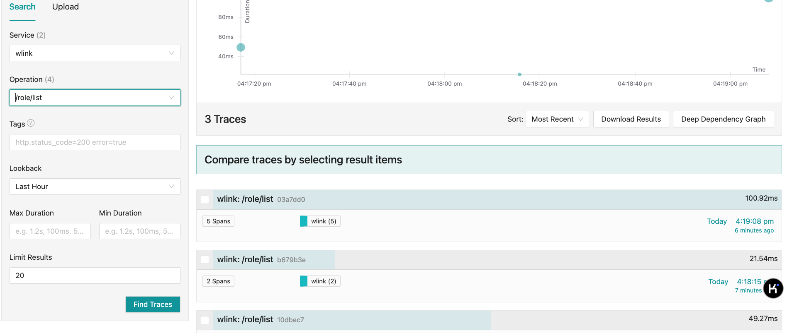
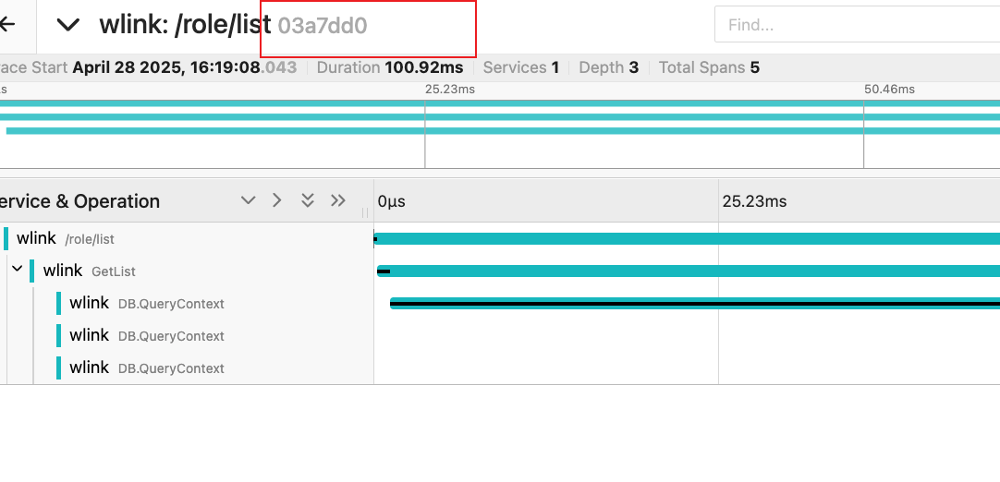
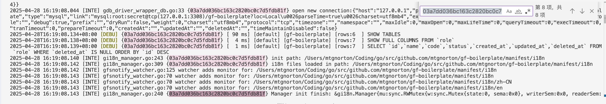
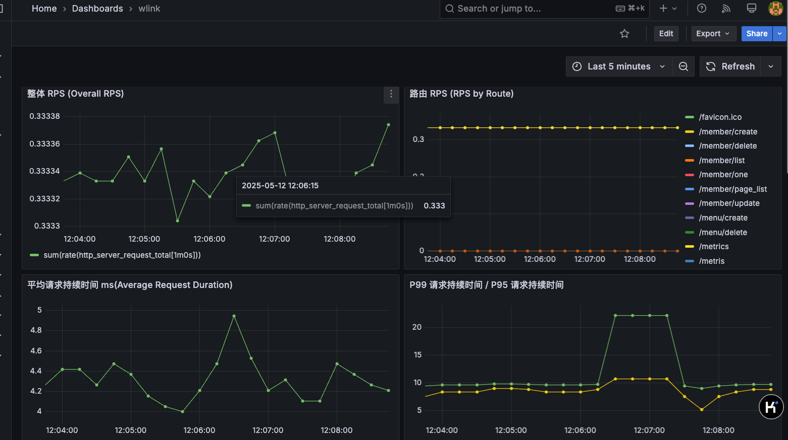

## 链路追踪
- 所有的调用层级都添加链路追踪相关信息,例如
    ```go

    func (c *ControllerRole) GetList(ctx context.Context, req *role.GetListReq) (res *role.GetListRes, err error) {
    	ctx, span := st.GetTracer().NewSpan(ctx, "GetList")
        defer span.End()

        res = &role.GetListRes{}
    ```
- 链路追踪是否开启根据后续情况调整,如果涉及微服务,或者复杂调用的单体项目,则开启,否则关闭

- 日志中的traceID和jager中traceID是一一对应的,遇到问题时,结合两者进行分析




- docker中运行jager 或 在根目录直接执行 `make jager`
    ```
    docker run --rm --name jaeger \
    -e COLLECTOR_ZIPKIN_HOST_PORT=:9411 \
    -p 16686:16686 \
    -p 4317:4317 \
    -p 4318:4318 \
    -p 14250:14250 \
    -p 14268:14268 \
    -p 14269:14269 \
    -p 9411:9411 \
    jaegertracing/all-in-one:1.64.0
    ```
    - 解释
    - 端口说明:
        - 16686: Jaeger UI界面访问端口,可以通过 http://localhost:16686 访问
        - 4317: OTLP gRPC端口,用于接收OpenTelemetry格式的追踪数据
        - 4318: OTLP HTTP端口,用于接收OpenTelemetry格式的追踪数据
        - 14250: 用于接收model.proto格式的追踪数据
        - 14268: 用于直接接收Jaeger客户端上报的追踪数据
        - 14269: Jaeger Collector的管理端口
        - 9411: 用于接收Zipkin格式的追踪数据

    - 环境变量说明:
        - COLLECTOR_ZIPKIN_HOST_PORT: 配置Zipkin collector的监听地址和端口

    - all-in-one表示这是一个集成了所有Jaeger组件的单机版本,包含:
        - Agent: 接收客户端上报的追踪数据
        - Collector: 接收和处理追踪数据
        - Query: 提供查询API
        - UI: 提供可视化界面

## 指标
- 使用 `make prometheus_grafana` 在本地启动prometheus和grafana,通过http://localhost:9092 访问prometheus,通过 http://localhost:3000 访问grafana,
- goframe内置的指标添加到grafana,包含以下指标,对应配置文件为`manifest/deploy/dependent/prometheus_grafana/grafana_dashboard/gf_internal.json`

  -   "整体 RPS (Overall RPS)"
  -  "路由 RPS (RPS by Route)"
  -  "平均请求持续时间 ms(Average Request Duration)"
  -  "title": " P99 请求持续时间 / P95 请求持续时间"
  -  "请求输入/输出流量 单位:bytes/sec (B/s)"
  -  "响应输出流量 (Outgoing Response Data Rate)"
  -  "活跃请求数 (Active Requests)"
  -  "title": " 5xx 错误率 (%) / 4xx 错误率 (%)"
  -  "GC 暂停时间占总时间百分比 (Time Spent in GC Pause)"
  -  "Go 内存使用情况 (Go Memory Usage)"
  -  GC 发生频率 (GC Cycles Rate) count/sec
  -  "Goroutine 数量 (Goroutine Count)"
- 部分业务指标需要进行收集,收集用法参考: https://goframe.org/examples/observability/metric/basic
    - 第三方接口调用的耗时和成功率
    - 消息队列积压和延迟
    - 核心业务,比如返佣计算耗时和失败率
