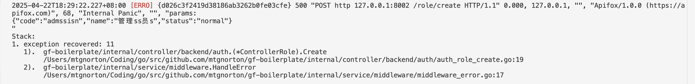
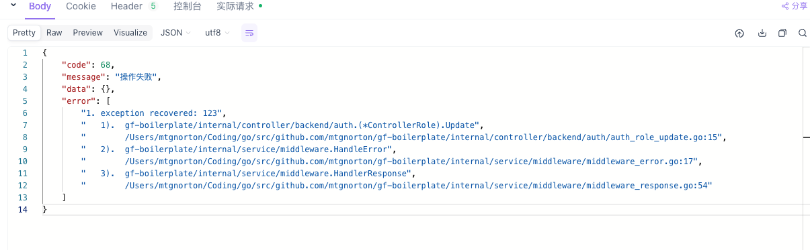
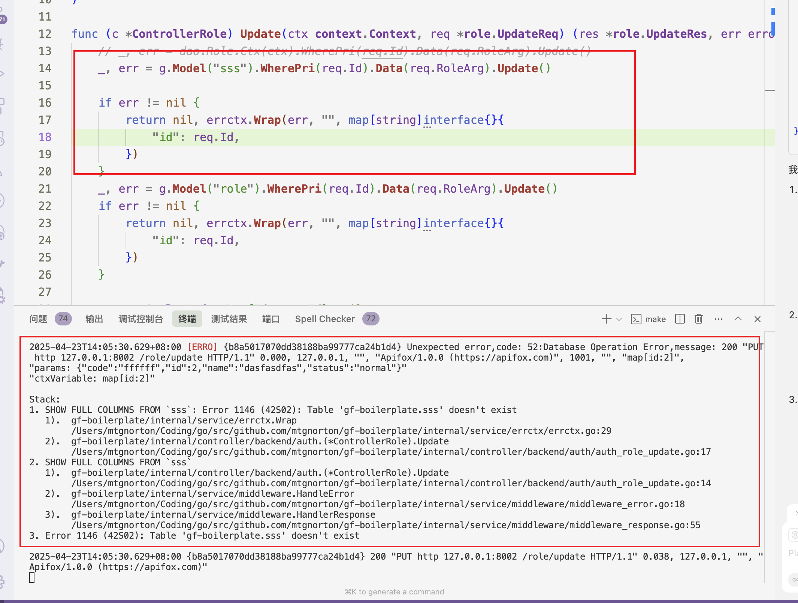
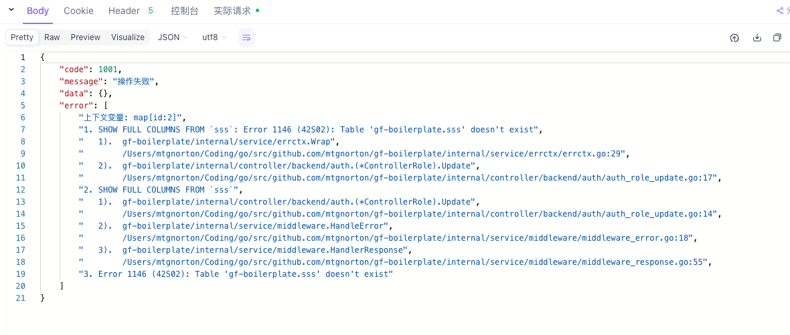
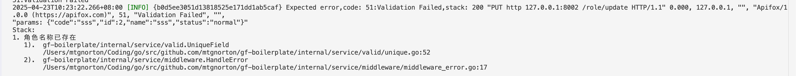
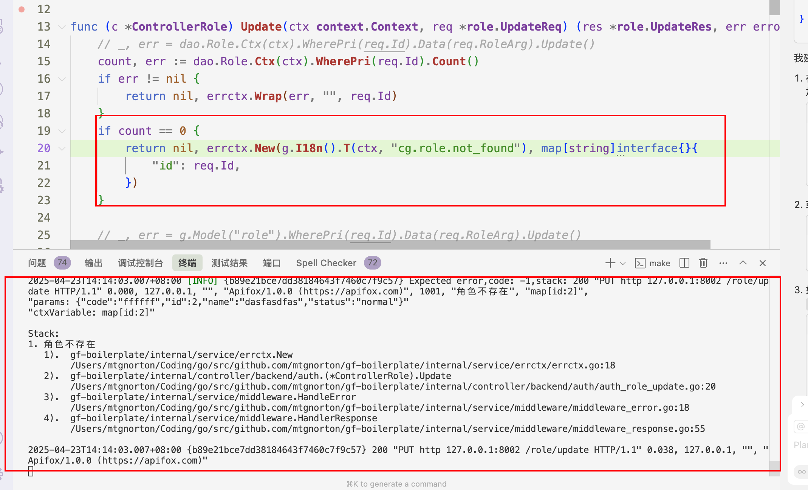
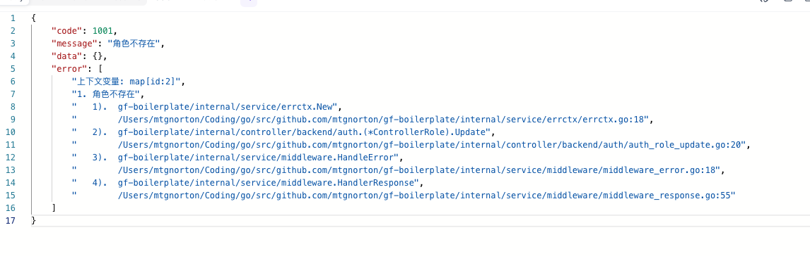
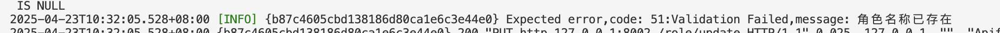

## 目标
- 统一错误处理的方式,规范错误日志和响应
- 快速定位问题,提高发现问题和解决问题的效率
- 后续考虑接入sentry,提高错误监控能力

## 概述
- gf框架所有底层组件对返回的错误都带有堆栈信息,gerror 文档: https://goframe.org/docs/core/gerror 

- 错误主要分为 **panic错误,非预期错误(如数据库查询错误等),预期错误(如输入错误)**

- 错误展示的详细程度由是否是debug模式决定,debug由配置文件决定,也可以通过请求头`x-debug`设置,后续考虑增加其他动态设置方式
- 错误日志包含堆栈信息,请求和参数相关信息,后续会增加已登录的用户信息

	| 错误类型 | 开启debug | 关闭debug |
	| -------- | ------------ | ------------ |
	| panic错误 | 和是否开启debug无关,展示详细堆栈,日志Error级别,发送飞书告警信息  |
	| 非预期错误 | 和是否开启debug无关, 展示详细堆栈,日志Error级别  |
	| 预期错误 |   展示堆栈,日志Info级别 | 不展示堆栈,日志Info级别 |
	| 响应是否返回错误 | 在error字段显示堆栈 | 否 |

## 错误传递和上下文
| 错误类型(返回提示语) | 堆栈信息 | 上下文需求 | 处理方式 |
| -------- | ------------ | ------------ | ------------ |
| 非预期错误 | 有堆栈 | 需要上下文 | errctx.Wrap(err, message, details) |
| 非预期错误 | 有堆栈 | 不需要上下文 | 直接返回错误 |
| 非预期错误 | 没有堆栈 | 需要上下文 | errctx.Wrap(err, message, details) |
| 非预期错误 | 没有堆栈 | 不需要上下文 | errctx.Wrap(err) |
| 预期错误 | 错误为nil | 需要上下文 | errctx.New(message, details) |
| 预期错误 | 错误为nil | 不需要上下文 | errctx.New(message) |
| 预期错误 | 错误不为nil | 需要上下文 | errctx.Wrap(err, message, details) |
| 预期错误 | 错误不为nil | 不需要上下文 | errctx.Wrap(err, message) |

- errctx 参见 `internal/service/errctx/errctx.go`
- 总结:
  - 不需要上下文信息,detail参数忽略
  - 预期错误需要给用户返回提示语的,message参数传入国际化字符串
  - 非预期错误,是gf框架组件返回的错误或者上游使用gerror.New返回的错误,直接返回错误,不需要处理,中间件已经统一处理了返回信息
  

## 不同错误日志和响应对比
- panic错误
	- 日志
	
	- 响应
	
- 非预期错误
	- 非预期错误不需要在Wrap中添加错误信息,直接使用`gerror.Wrap(err,"")`,因为堆栈信息已经足够
	- 日志
	
	- 响应
	
- 预期错误
	- 校验错误(不满足校验规则触发),开启debug
	
	- 代码内部主动返回的错误,开启debug
	 - 日志
	
	 - 响应
		 
	- 关闭debug
	

